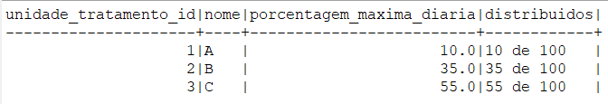

## POC de distribuição de pacotes para transportadora

### Objetivo
O objetivo desta POC é demonstrar a distribuição de 
pacotes para uma transportadora, onde cada unidade de tratamento tem uma porcentagem 
máxima de pacotes que podem ser distribuídos por dia.

Para rodar a aplicação: 

Rode o sql schema.sql e data.sql em seu banco Mysql

Verificando resultados:
```
SELECT
d.unidade_tratamento_id,
ut.nome,
ut.porcentagem_maxima_diaria,
CONCAT(
COUNT(1),
' de ',
(SELECT COUNT(1) FROM distribuicao_db.distribuicao)
) AS distribuidos
FROM
distribuicao_db.distribuicao d
INNER JOIN
unidade_tratamento ut ON ut.id = d.unidade_tratamento_id
GROUP BY
d.unidade_tratamento_id, ut.nome, ut.porcentagem_maxima_diaria;
```


