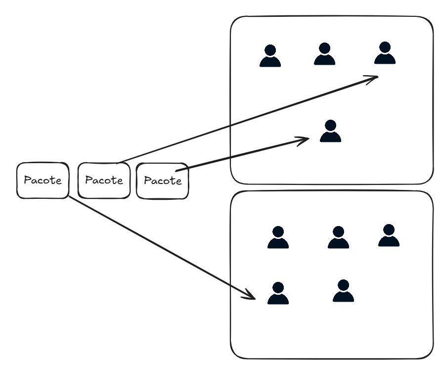

## POC de distribuição de pacotes para transportadora

### Objetivo
O objetivo desta POC é demonstrar a distribuição de 
pacotes para uma transportadora, onde cada unidade de tratamento tem uma porcentagem 
máxima de pacotes que podem ser distribuídos por dia.

A unidade pode escolher clientes estratégicos para ter prioridade no recebimento dos pacotes.
Se uma unidade UA escolhe receber os pacotes do Cliente A, todos os pacotes de A serão tratados por UA.

Além disso, os usuários (de uma unidade) têm uma porcentagem máxima de pacotes que podem ser recebidos por dia dentro da unidade.



Verificando resultados:

```
WITH total_distribuicoes AS (
    SELECT COUNT(*) AS total
    FROM distribuicao
),
unit_distribuicoes AS (
    SELECT
        ut.id AS unidade_id,
        ut.nome AS unidade_nome,
        ut.porcentagem_maxima_diaria AS porcentagem_teorica_unidade,
        COUNT(d.id) AS quantidade_distribuida_unidade
    FROM
        distribuicao d
    INNER JOIN usuario u ON
        d.usuario_id = u.id
    INNER JOIN unidade_tratamento ut ON
        u.unidade_tratamento_id = ut.id
    GROUP BY
        ut.id,
        ut.nome,
        ut.porcentagem_maxima_diaria
),
user_distribuicoes AS (
    SELECT
        u.id AS usuario_id,
        u.nome AS usuario_nome,
        u.porcentagem_maxima_diaria AS porcentagem_teorica_usuario,
        ut.id AS unidade_id,
        COUNT(d.id) AS quantidade_distribuida_usuario
    FROM
        distribuicao d
    INNER JOIN usuario u ON
        d.usuario_id = u.id
    INNER JOIN unidade_tratamento ut ON
        u.unidade_tratamento_id = ut.id
    GROUP BY
        u.id,
        u.nome,
        u.porcentagem_maxima_diaria,
        ut.id
)
SELECT
    ud.unidade_id,
    ud.unidade_nome,
    ud.porcentagem_teorica_unidade as "%_teorica_un",
    ud.quantidade_distribuida_unidade as "qte_un",
    ROUND((ud.quantidade_distribuida_unidade * 100.0) / td.total, 2) AS "%_real_un",
    ud2.usuario_id,
    ud2.usuario_nome,
    ud2.porcentagem_teorica_usuario as "%_teorica_usr",
    ud2.quantidade_distribuida_usuario as "qte_teorica_usr",
    ROUND((ud2.quantidade_distribuida_usuario * 100.0) / td.total, 2) as "%_real_usr"
FROM
    unit_distribuicoes ud
INNER JOIN user_distribuicoes ud2 ON ud.unidade_id = ud2.unidade_id
CROSS JOIN total_distribuicoes td
ORDER BY
    ud.unidade_id,
    ud2.usuario_id;
```

```
unidade_id|unidade_nome|%_teorica_un|qte_un|%_real_un|usuario_id|usuario_nome|%_teorica_usr|qte_teorica_usr|%_real_usr|
----------+------------+------------+------+---------+----------+------------+-------------+---------------+----------+
         1|Unidade A   |        25.0|    25|    25.00|         1|Func1A      |         50.0|             12|     12.00|
         1|Unidade A   |        25.0|    25|    25.00|         2|Func2A      |         45.0|             11|     11.00|
         1|Unidade A   |        25.0|    25|    25.00|         3|Func3A      |          5.0|              2|      2.00|
         2|Unidade B   |        25.0|    25|    25.00|         4|Func1B      |         50.0|             13|     13.00|
         2|Unidade B   |        25.0|    25|    25.00|         5|Func2B      |         50.0|             12|     12.00|
         3|Unidade C   |        25.0|    25|    25.00|         6|Func1C      |         60.0|             15|     15.00|
         3|Unidade C   |        25.0|    25|    25.00|         7|Func2C      |         40.0|             10|     10.00|
         4|Unidade D   |        25.0|    25|    25.00|         8|Func1D      |         90.0|             22|     22.00|
         4|Unidade D   |        25.0|    25|    25.00|         9|Func2D      |         10.0|              3|      3.00|  
```